# PAI-CC Mermaid 流程图

## 1. iOS端智能连拍流程

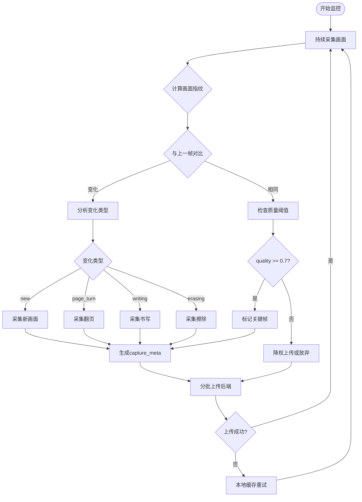

## 2. 后端处理流程

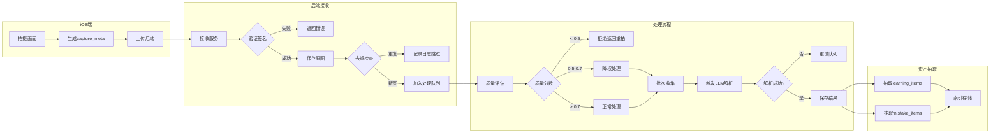

## 3. 学习回合状态机

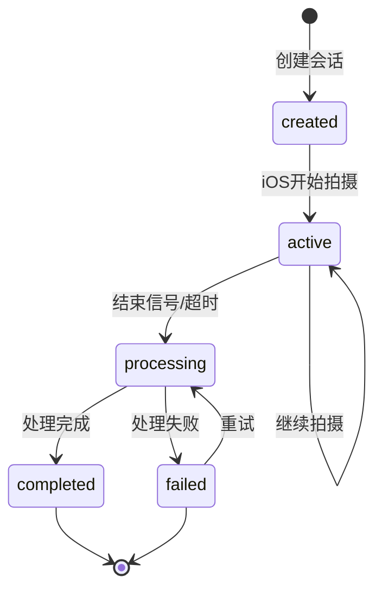

## 4. 错题生命周期

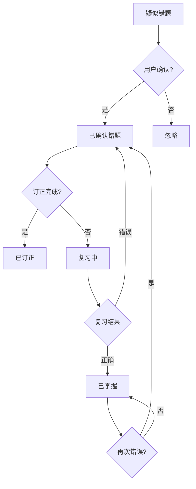

## 5. 复习状态机

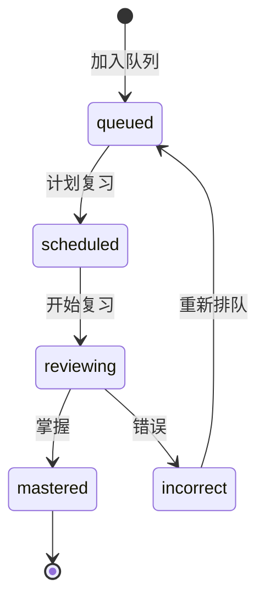

## 6. LLM批次解析流程

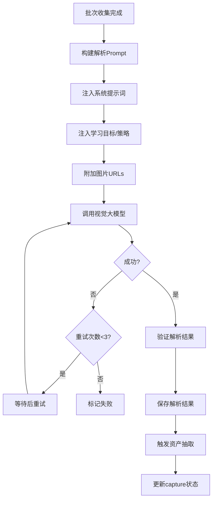

## 7. 最终报告生成

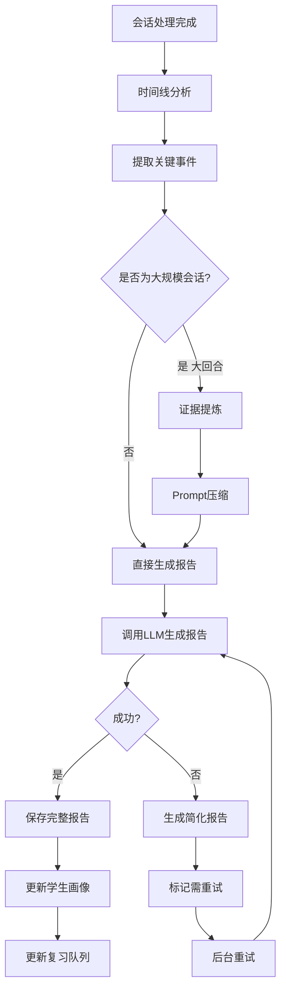

## 8. 完整数据流

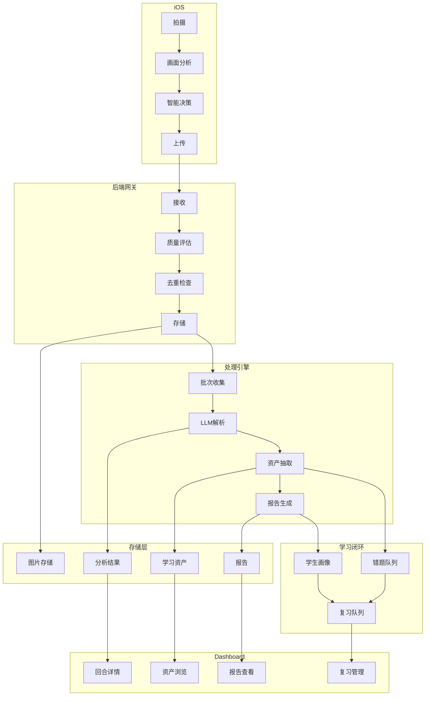

## 9. 时序图 - 单张拍题

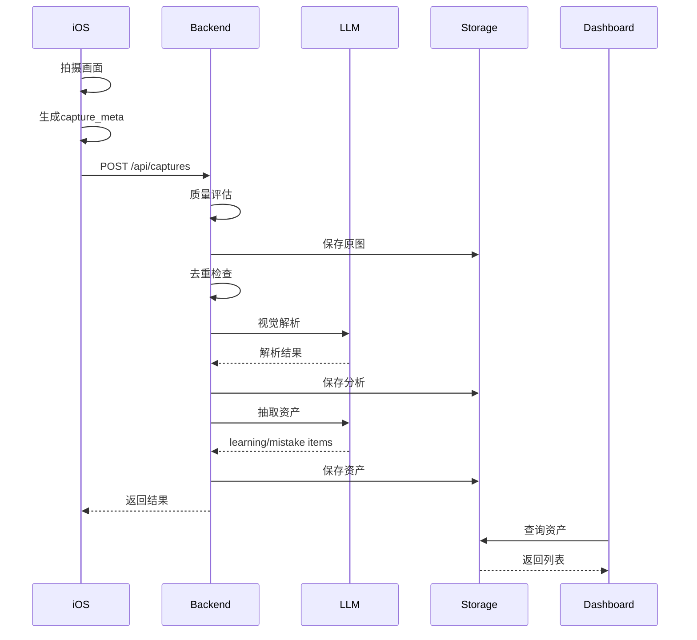

## 10. 时序图 - 智能连拍回合

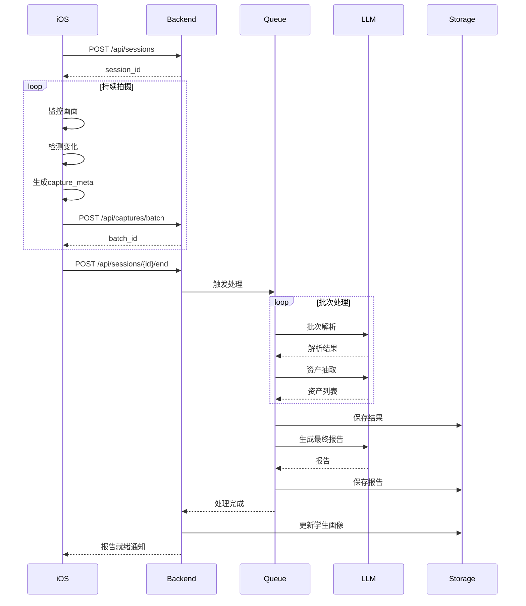

## 11. 复习队列优先级

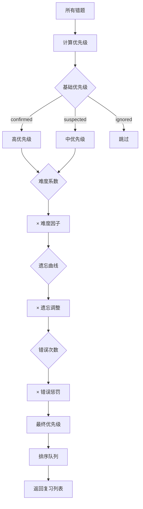

## 12. Dashboard API关系

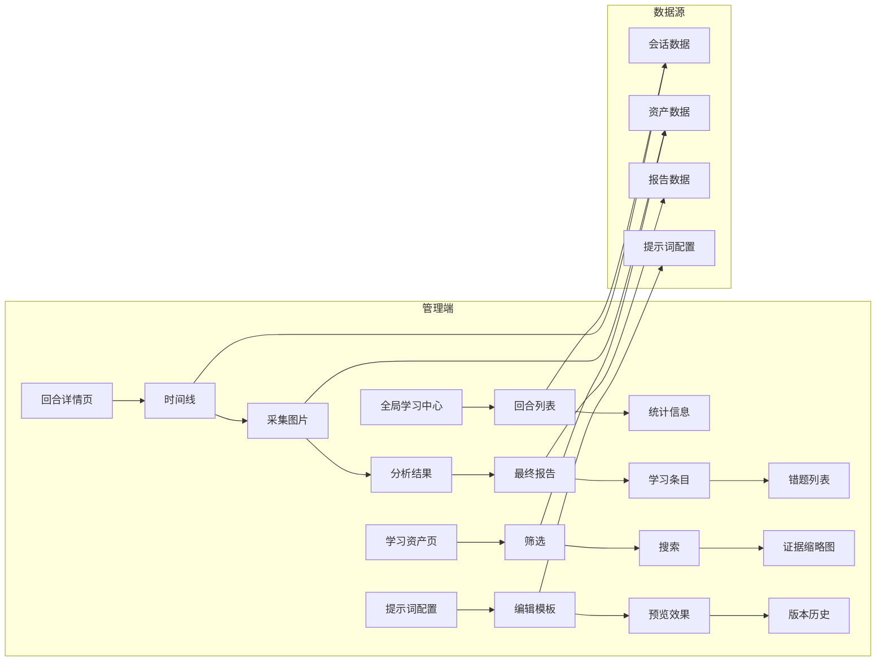